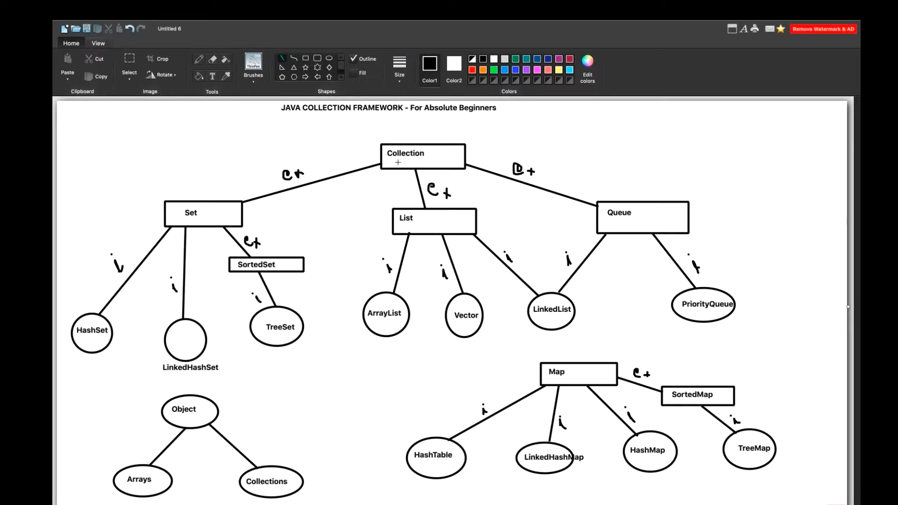
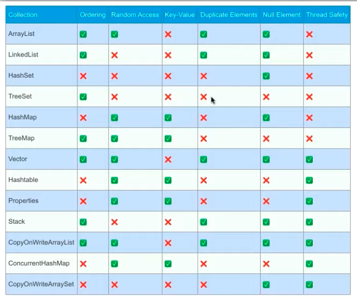

<h1 style="color:yellow;background-color:blue;padding:1rem">Notes</h1>

# naveen automation labs youtube channel

### playlist link:
https://www.youtube.com/playlist?list=PLFGoYjJG_fqoDQHufg7XVk-yb2w6CNpgF

 
 
 

image nung whole collection framework: 

https://youtu.be/B4WmfcjQ9QA?t=741

 
 
 
 
 

### list:
1. an order based collection
1. index based
    1. ArrayList
    1. LinkedList
1. Dynamic Array
    - dynamic implementation of array
    - size will increase or decrease automatically

### set:
1. similar to 'set' in discrete-math
1. cannot have duplicate elements

### queue:
1. fifo

### map:
1. stores data in key and value pair format

### iterator
1. to iterate the elements from a collection
    1. collection could be anything, list, map, or set
    1. halimbawa yung map or set, walang indexing doon, kaya di makakagamit ng typical for-loop
    1. kaya kelangan gumamit ng iterator
1. iterator is another interface that provides the methods that can be used to access the elements of a particalar collection

### why are we using collection
1. it reduces programming effort
    1. we do not need to write the same code again and again
    1. kapag gusto mo gumamit ng arrayList, or ng dynamic array, you can directly use that
    1. you just need to create the object of arrayList
    1. kung gusto naman na mag-store ng data in the form of set objects, readily available na agad yung collection-framework
1. provides in-built methods and classes, which we can use according to our use-case
1. optimized and highly performant
1. increase productivity
1. reduce the operational time
1. interoperability
    1. example, two system that want to interact in the form of APIs
    1. kapag nagsend si api ng hashmap, pwede ko gamitin yung hashmap on my own purpose na same format pa din, kasi pareho ng ginamit na library

### common methods sa collectionFrameworks
1. get()
1. size()
1. add()
1. addAll()
1. remove()
1. removeAll()
1. clear()
1. contains()
1. containsAll()
1. retain()
1. retainAll()

### common exceptions
1. null pointer exception
1. class cast exception
1. illegal argument exception
1. illegal state exception
1. unsupported operation exception

### matrix of differences within each collections:

 
 
 
 
 
 
 
 
 
 

---
---
---
---
---
---
---
---
---
---

## Getting Started

Welcome to the VS Code Java world. Here is a guideline to help you get started to write Java code in Visual Studio Code.

## Folder Structure

The workspace contains two folders by default, where:

- `src`: the folder to maintain sources
- `lib`: the folder to maintain dependencies

Meanwhile, the compiled output files will be generated in the `bin` folder by default.

> If you want to customize the folder structure, open `.vscode/settings.json` and update the related settings there.

## Dependency Management

The `JAVA PROJECTS` view allows you to manage your dependencies. More details can be found [here](https://github.com/microsoft/vscode-java-dependency#manage-dependencies).
